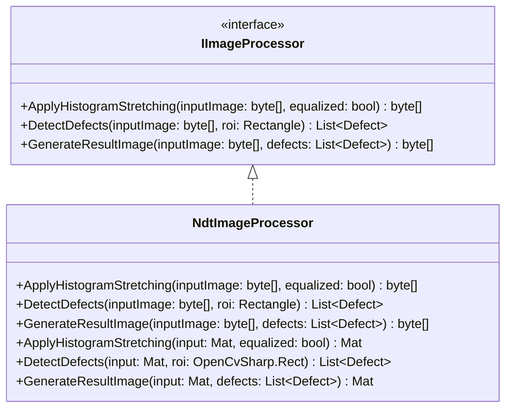
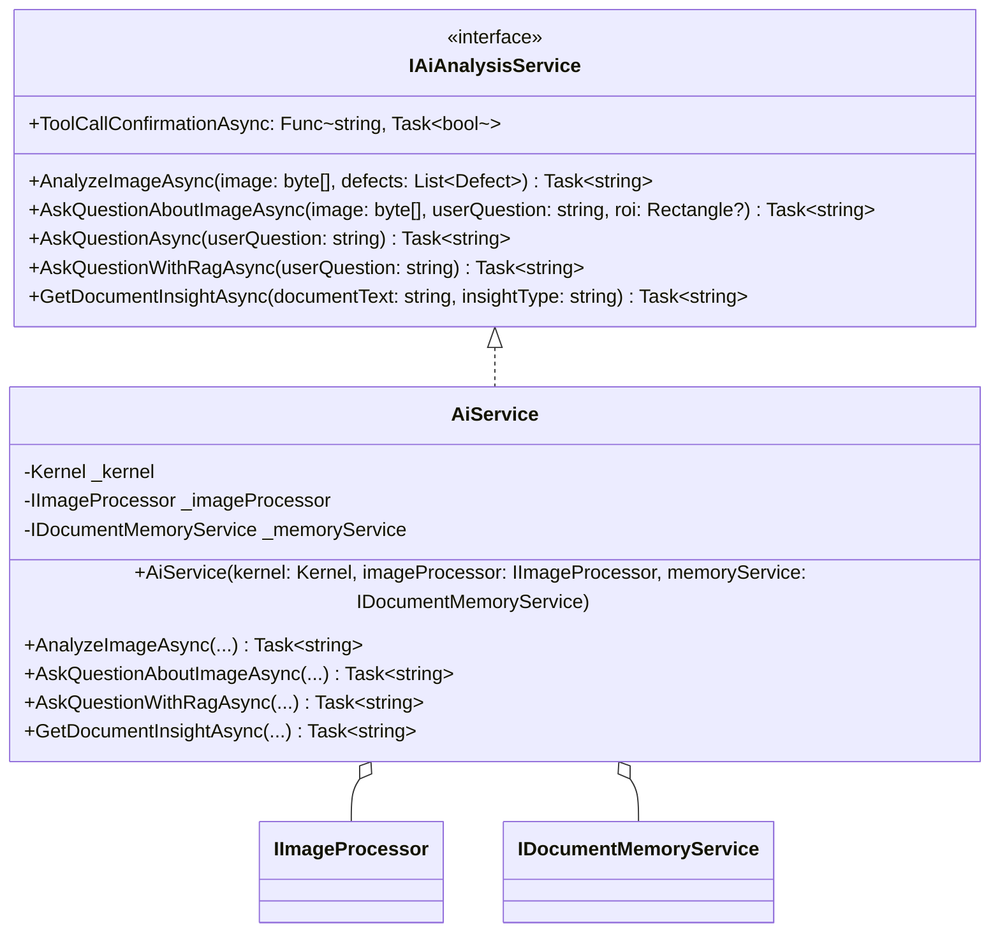
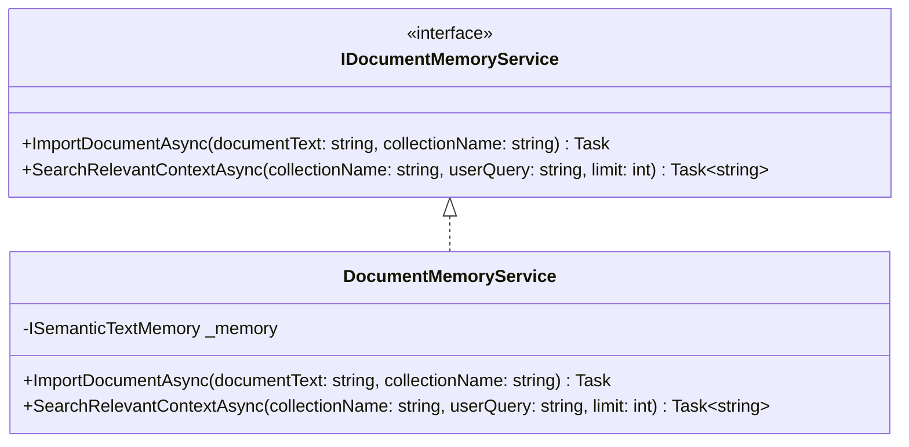
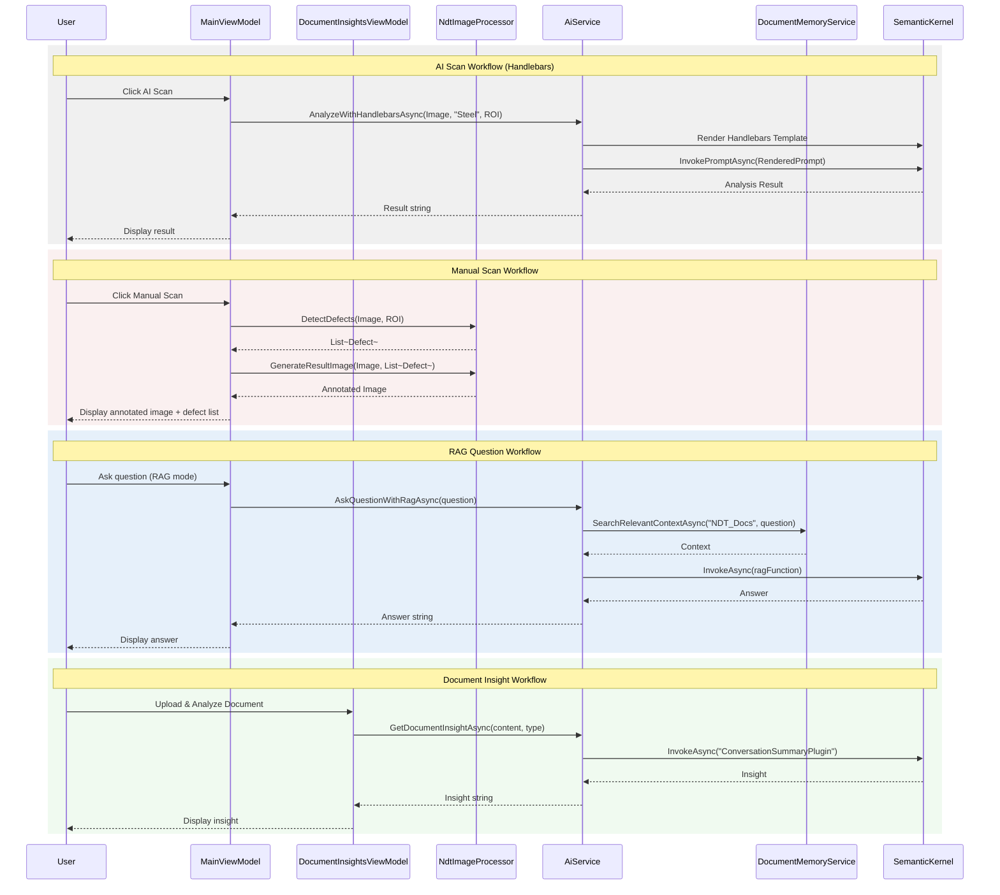

# Application Service Diagrams

This document contains Mermaid diagrams for the services and the overall application flow.

## Service Class Diagrams

### Image Processor Service
The `NdtImageProcessor` handles low-level image operations using OpenCV (OpenCvSharp).
Source: `Ndt.Infrastructure.ImageProcessing/ImageProcessor.mermaid`

### AI Analysis Service
The `AiService` orchestrates AI-driven analysis using Semantic Kernel. It depends on other services and plugins.
Source: `Ndt.Infrastructure.AI/AiService.mermaid`

### Document Memory Service
The `DocumentMemoryService` manages vector storage and retrieval for RAG (Retrieval-Augmented Generation) capabilities.
Source: `Ndt.Infrastructure.AI/DocumentMemoryService.mermaid`

## Overall Application Sequence Diagram
The following diagram illustrates the core workflows of the NDT Inspection System.
Source: `Ndt.UI.Wpf/AppSequence.mermaid`

